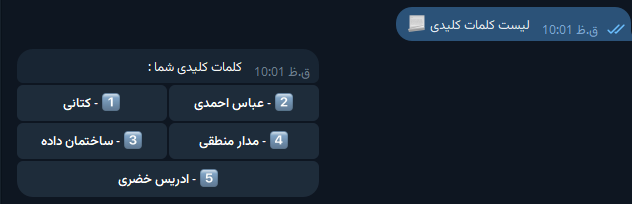
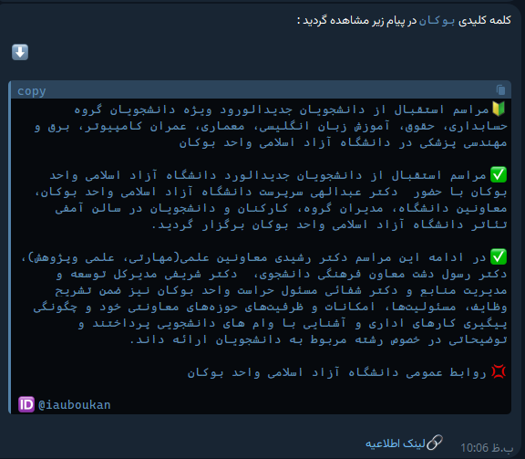

## Telegram Notification Manager
[](https://choosealicense.com/licenses/mit/)
[](http://www.gnu.org/licenses/agpl-3.0)
[](https://opensource.org/licenses/)[](https://opensource.org/licenses/)

This project is a *Telegram* bot developed using **Python (Telethon)** that listens to messages from a public *Telegram* channel using a personal *Telegram* account. New events from the monitored channel are processed and saved into a database. The bot incorporates the **Aho-Corasick** algorithm for efficient keyword searching within messages.

## Features

- **Real-Time Message Listening**: Monitors a public Telegram channel for new messages using a personal Telegram account. 
- **Database Integration**: Saves all received messages and events directly into a database for persistent storage.
- **Efficient Keyword Search**: Utilizes the Aho-Corasick algorithm for fast and efficient pattern matching within channel messages.
- **Persoanlized Notifications**: Redirecting the mentioned telegram channel messages into your chat if each of your keywords is complianced.


## Setup
### - installing Packages
```
pip install requirements.txt -r
```

### - seting environment variables
#### Postgresql database required variables :
```python
user = os.getenv("db_user"),
password = os.getenv("db_password"),
host = os.getenv("db_host"),
port = os.getenv("db_port"),
dbname =os.getenv("db_dbname")
```
#### Creating required Tables in postgresql:
```sql
CREATE TABLE IF NOT EXISTS users (
            user_id BIGINT PRIMARY KEY,
            user_name VARCHAR(255),
            first_name VARCHAR(255),
            last_name VARCHAR(255),
            phone_number VARCHAR(50)
CREATE TABLE IF NOT EXISTS keywords (
            id BIGINT PRIMARY KEY,
            keyword VARCHAR(255),
            user_id BIGINT REFERENCES users(user_id) ON DELETE CASCADE
        );
CREATE TABLE IF NOT EXISTS messages (
            id BIGINT PRIMARY KEY,
            telegram_id BIGINT,
            content TEXT,
            status VARCHAR(50),
            created_at TIMESTAMP DEFAULT CURRENT_TIMESTAMP,
            updated_at TIMESTAMP,
            deleted_at TIMESTAMP
        );
```
- or you can simply call the `creating_tables` function which located in `db.py` file.

#### Telethon required variables :
- you can get this data [here](my.telegram.org).
```
redirect_from = os.getenv("redirect_from") # you can add your desired channel for listening
session_user = os.getenv("session_user")
session_bot = os.getenv("session_bot")
api_id = os.getenv("api_id")
api_hash = os.getenv("api_hash")
bot_token = os.getenv("bot_token")
```
- **desired_channel**: the channel you want to monitor.
- **session_user**: A session of a telegram account which is a member of desired Telegram channel. 
- **session_bot**: the session of your telegram bot.
- **api_id** and **api_hash** : are available in `my.telegram.org`.
- **bot_token**: you can get it from [@BotFather](https://t.me/BotFather)


## Screenshots




